  

## 📌 About Me
💻 Full Stack Developer passionate about building scalable, efficient, and real-world impactful applications. 
🎓 B.Tech CSE student at MITS Gwalior (CGPA: 8.51). 
⚡ Skilled in Next.js, React, TypeScript, Node.js, Express, REST APIs, MongoDB. 
🔐 Experience in JWT Authentication, RBAC, backend optimization & real-time systems. 
📊 Built Finance Dashboard, AI Mental Health Platform, ML Disease Detection System. 
🧠 Solved 300+ DSA problems (LeetCode 1600+). 
🏆 Top 30 – Smart India Hackathon | Rank 5 – Code Coalescence. 
🌱 Exploring System Design, Scalability & AI Integration. 
🤝 Open to internships & impactful collaborations. 

## 🧠 My Focus Areas
🚀 Scalable full stack development 
🔐 Secure backend architecture (JWT, RBAC) 
⚡ High-performance APIs 
🏗️ System design for real-world apps 
🤖 AI/ML integration 
🧼 Clean & maintainable code 
🧠 Strong DSA problem-solving 

## 📊 GitHub Stats & Trophies

  
  

  

  

  

## 🛠️ Languages & Tools

### 💻 Programming Languages

  
  
  
  
  

---

### 🎨 Frontend

  
  
  
  
  
  
  
  

---

### ⚙️ Backend

  &nbsp;
  &nbsp;
  <!-- &nbsp; -->

---

### 🗄️ Database

  <!--  -->
  

---

### 🧰 Tools

  
  
  
  

---

  

---

## 🔗 Connect with Me

  
  
  
  

  
  

  

  

